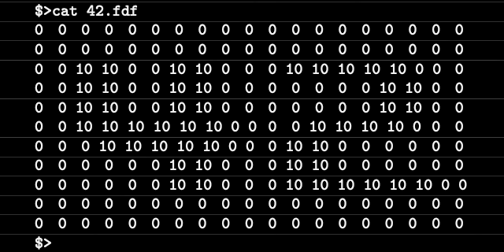
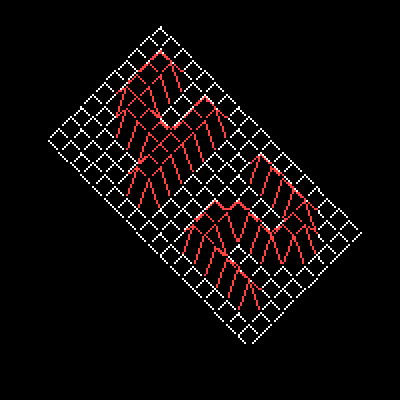

<h1 align="center">FdF</h1>

#### This project is a little bit different from the other ones. For this project we will have to make a program capable of drawing 3D maps with help of the [`MiniLibX`](./mlx) graphic library. We will learn how to place points in space and how to join them with segments.

## 📖 Content 📖

### 📚 Mandatory Part 📚

- **Name of the program** : `fdf`
- **Files** : [`*.c`](./src) [`fdf.h`](.fdf.h) [`Makefile`](./Makefile)
- **Makefile rules** : `all` `clean` `fclean` `re`
- **Authorized functions** : [`open`](https://man7.org/linux/man-pages/man2/open.2.html) [`read`](https://man7.org/linux/man-pages/man2/read.2.html) [`write`](https://man7.org/linux/man-pages/man2/write.2.html) [`close`](https://linux.die.net/man/2/close) [`malloc`](https://man7.org/linux/man-pages/man3/free.3.html) [`free`](https://man7.org/linux/man-pages/man3/free.3.html) [`perror`](http://www.w3big.com/es/cprogramming/c-function-perror.html) [`strerror`](http://www.w3big.com/es/cprogramming/c-function-strerror.html) [`exit`](https://www.tutorialspoint.com/c_standard_library/c_function_exit.htm) [`math library`](https://www.tutorialspoint.com/c_standard_library/math_h.htm) [`miniLibX library`](./mlx)
- [**Libft**](https://github.com/Zsolt42/Libft) **authorized**.
- The `fdf` should print the map using an isometric view.
- You shoould be able to exit the program using `ESC`

## 🔥 USAGE 🔥

#### To compile this project you only have to execute the `make` command.
#### For this project we will need some [`maps`](./maps) that should look like this:

  

#### This maps are a series of numbers where:

- The horizontal position of the number corresponds to de position of the point in the X axis
- The vertical position of the number corresponds to de position of the point the Y axis
- The value of the number corresponds to de heigth or the position of the point in the Z axis

#### To execute this program you sould execute this command:

#### `./fdf 42.fdf`

#### And you should see something like this:

  

### ⌨️ BUTTONS ⌨️

#### - key `↥` for moving the drawing upwards
#### - key `↧` for moving the drawing downwards
#### - key `←` for moving the drawing leftwards
#### - key `↦` for moving the drawing rightwards
#### - key `W` to increase the value of `z` position
#### - key `S` to decrease the value of `z` position
#### - key `Q` to increase the value of zoom
#### - key `E` to decrease the value of zoom
